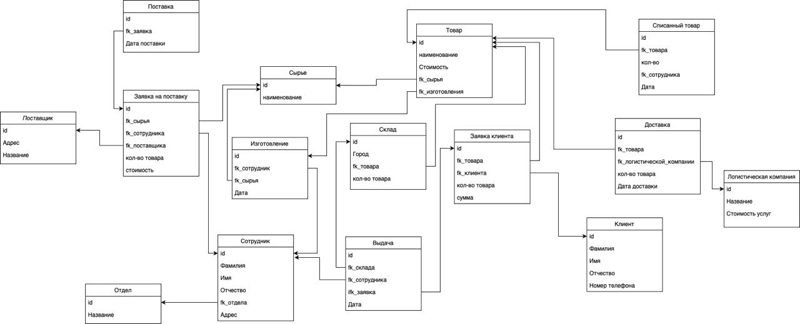

# Учет и реализация косметики.
Предприятие, занимающееся производством и реализацией косметической продукции, является комплексной организацией, которая сочетает в себе исследование и разработку, производство, маркетинг и продажу. 
В рамках работы сделана контекстная диаграмма, где указанны нормативные документы, участники процесса, входящие и выходящие потоки.

Далее сделана детализация контекстной диаграммы, где отображены этапы процесса учета и реализации косметики.

Сделана детализация процесса поставки сырья для углубленного понимая модели работы с поставками.

После этого была построена логическая модель базы данных для описания объектов предметной области, их атрибутов и взаимосвязей между ними.

